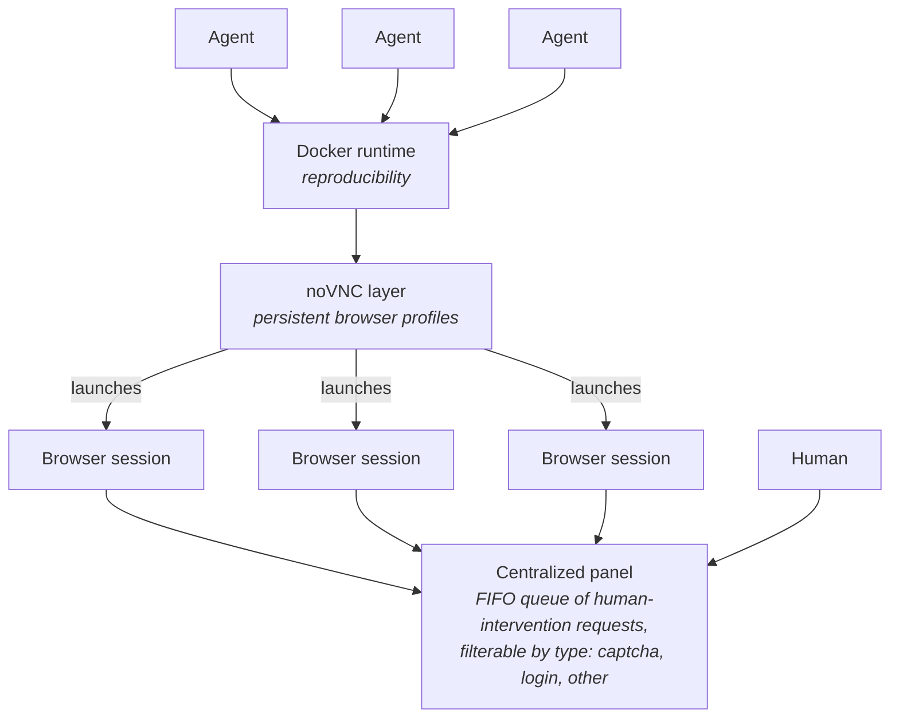

# Sagasu

**Human-in-the-loop browser infrastructure for autonomous agents.**

Sagasu gives headless agents a way to hand a live browser session to a human — for CAPTCHAs, logins, 2FA, or anything else an agent shouldn't (or can't) do itself — and then take the session back and keep working: a reproducible, multi-agent, multi-session system with a single place for humans to service requests.

Sagasu is an **X-input-first browser skill**. An agent's normal loop is to capture the full X11 display, reason over what is visibly on screen, and drive the real cursor and keyboard through the session's X server. CDP is a supplemental channel for operations that are more direct or reliable as browser commands — opening a URL, waiting for navigation, inspecting the DOM or accessibility tree, inserting Unicode text, attaching a file, and managing cookies. CDP and the DOM inform or shortcut the interaction; they are not the default clicking path.

## The problem

Agents doing real work on the web constantly hit walls that require a human: CAPTCHA challenges, SSO logins, 2FA prompts, consent screens. And the ways agents browse the web today — including the existing human-handoff tools — have structural problems:

- **Computer use takes over your device.** Computer-use and active browser-use agents drive *your* screen, keyboard, and browser. While the agent works, the machine is effectively unusable — and since there is one desktop and one cursor, parallelism and multi-agent sessions are a non-starter.
- **The agent can't raise its hand.** Existing handoff tools are watch-and-intervene: a human must already be looking at the screen to notice the agent is stuck. There is no primitive for the agent to signal "I'm blocked on a CAPTCHA at session X — come help."
- **There's no resume signal either.** The mirror problem: after the human solves the challenge, nothing tells the agent it's done. Agents poll the DOM hoping the challenge iframe disappeared, or the human types "done" into a chat.
- **Session sprawl instead of a fleet.** Every blocked session surfaces its own URL and password through its own channel. Three agents blocked on three CAPTCHAs means three links pasted into three chats, in no particular order, with nothing tracking what's pending or resolved.
- **Ephemeral state.** Browser sessions live in throwaway profiles; every new task starts logged out, and the human re-authenticates to the same sites over and over.
- **The CAPTCHA comes back.** Anti-bot systems challenge fresh, anonymous-looking sessions far more aggressively than established ones. A throwaway browser that gets a human solve and is then discarded re-triggers the same challenge on the next task — handoff degenerates into a CAPTCHA treadmill for the human. (When and why this happens: [Problems.md](./Problems.md).)
- **Solvers hit a coverage ceiling.** Automated captcha-solving integrations work per-type: every supported family (reCAPTCHA, hCaptcha, GeeTest, …) is a dedicated integration that must be built and maintained, and everything outside the list is a dead end — custom in-house widgets, new captcha versions during the catch-up lag, regional systems beyond the big names (common on the Chinese web), and verification that isn't a captcha at all (SMS codes, WeChat/Alipay QR-code logins, confirm-on-your-phone). Some challenges also score *how* the answer is produced — GeeTest checks the mouse trajectory of the slider drag, so computing the right answer still fails the biometric. A human working inside the agent's own session covers all of it: anything a human can do in a browser, including scanning an on-screen QR code with their phone. Coverage is categorical, not a per-type list.

Implementation challenges encountered while building this are tracked separately in [Problems.md](./Problems.md).

## The idea



Four layers, together answering those problems: browsers run in containers off to the side (your device stays yours, sessions scale horizontally), state persists in named profiles, and every human ask lands in one queue. Inside each browser session, both agent and human act on the same X11 display and cursor; the agent additionally has a private, loopback-only CDP side channel for structured browser operations.

### 1. Docker runtime — reproducibility

The entire browser stack (TigerVNC's Xvnc — virtual display and VNC server in one process — window manager, browser, X-level screenshot/input tools, and websockify/noVNC) lives in a container image. Any host that can run Docker can run Sagasu identically — no host package installs, no leftover processes, no per-distro pitfalls. Spinning up a new browser session is a container-level operation with isolated displays, cursors, ports, and profile volumes, so concurrent sessions can't collide.

The browser itself is a configuration choice, not a hardcoded dependency. The default is **[Helium](https://github.com/imput/helium)** — a lightweight, privacy-focused Chromium fork that keeps the image small — with stock Chromium (or any Chromium-family browser that exposes CDP) as an alternative.

### 2. noVNC layer — persistent browser profiles

Browser sessions are launched against **named, persistent profiles** stored on volumes. When a human logs into a site once, that authenticated state (cookies, sessions) survives the container and is reusable by any agent on subsequent tasks. Log in to a service on Monday; agents keep working inside that session all week. Profiles are treated as sensitive material: they never leave the host's network boundary and are never baked into images.

### 3. Browser sessions — X input first, CDP second

Each agent request gets its own session container: a real X11 desktop with one browser on it, driven **computer-use style**. The default interaction contract is deliberately asymmetric:

- **Full-display screenshots + X11-level input** (agent-facing, primary): the agent sees the entire display — page, tab strip, extension buttons, browser popups — and acts through the display's real cursor and keyboard focus. Everything a human can click, the agent can click, browser chrome included.
- **CDP endpoint** (agent-facing, supplemental): the structured side channel. CDP navigates directly to URLs, waits on page lifecycle events, inserts text that X keyboard mapping cannot express reliably, handles uploads and cookies, and exposes the DOM and accessibility tree for semantic grounding.
- **noVNC view** (human-facing): the same live display, viewable and controllable from a web page when handoff is needed.

The agent and the human are looking at — and taking turns driving — the *same* browser through the *same* screen and cursor. That is the core trick: it's what makes "human solves the CAPTCHA, agent continues the job" seamless, and it makes a handoff nothing more than the agent going hands-off while the human works.

The default rule is: **see through the X display, act through X input, and use CDP only as a supplement.** Routine pointing, clicking, hovering, dragging, scrolling, and keyboard interaction go through the X cursor and focused window — not `Runtime.evaluate("element.click()")` or CDP mouse events. The DOM may identify an element and provide its viewport box, but the resulting action is translated into display coordinates and performed through X input.

**On session start, the agent is handed both the picture and the structure.** `session start` returns an initial full-display screenshot together with a DOM snapshot, so the agent begins with visual understanding plus supplemental semantic context. The working loop stays X-first from there: capture the display, determine what is visibly happening, optionally consult the DOM to ground a target, act through the X cursor or keyboard, then capture the display again to verify the outcome. Direct CDP verbs are reserved for operations such as `Page.navigate`, lifecycle waits, file attachment, cookie access, and `Input.insertText` for Unicode text. This also makes handoffs smarter: an agent that can see a challenge widget knows to enqueue a `captcha` request instead of fumbling selectors against it.

**Session modes.** The default is one task per container — each session has its own display, cursor, browser, and egress identity, so parallel agents never contend for input. For workloads where several subagents must work the *same logged-in site at the same time*, an opt-in shared-session mode is planned: one container, one browser, multiple windows — cookies and logins shared live across every window, each window driven by its own CDP session. That mode is an explicit exception to the X-input-first contract because one X display cannot provide an independent physical cursor per window. The verified mechanics and trade-offs are in [Problems.md](./Problems.md).

### 4. Centralized panel — the human's single pane of glass

Instead of per-session URLs and passwords relayed through chat, all human-intervention requests land in one web dashboard:

- **FIFO queue** of pending requests, so the human services them in order and nothing gets lost.
- **Typed/filterable requests** — an agent enqueues a request tagged `captcha`, `login`, or `other`, and the human can filter to what they care about (or triage logins before captchas).
- **Embedded noVNC** — clicking a queue item opens the live browser session right in the panel. Resolve it, mark it done, and the owning agent resumes automatically.

One URL, one credential, every blocked agent visible at a glance.

## Setup & configuration: a required first-run step

Installing the skill is not enough on its own — Sagasu requires an explicit setup pass before the first session, in the style of skills that ship `/setup` and `/config` commands. Setup is where the deployment-shaping choices get made once, recorded in a config file, and inherited by every session afterward:

- **Browser** — which browser runs inside noVNC. Default: **Helium** (lightweight Chromium fork); alternatives selectable at setup.
- **Network boundary** — LAN (default), localhost-only, or bring-your-own proxy/VPN.
- **Profile storage** — where persistent browser profiles live on disk.
- **Panel** — port/address and access credential for the dashboard.

`/setup` runs interactively on install (pull the image, make the choices above, verify the boundary); `/config` views or changes any of it later. Agents and the panel read the same config, so there is exactly one source of truth — no per-session flags drifting away from what the human thinks is deployed.

## Agent interface: CLI + skill

Agents interact with Sagasu through a small CLI (driven via shell) documented by an accompanying skill file — no long-running orchestration API to maintain. The expected verbs, roughly:

```
sagasu setup                                                   # interactive first-run: browser, network, storage, panel
sagasu config [get|set <key> [value]]                          # view or change configuration after setup
sagasu session start [--profile <name>] [--url <start-url>]   # launch a session; print session id + CDP side channel
                                                               #   and return an initial screenshot + DOM snapshot
sagasu session screenshot <session-id> [--out <path>]          # capture the full display, browser chrome included
sagasu session cursor <session-id> move|click|drag ...          # primary: drive the real X cursor
sagasu session key <session-id> press|type ...                  # primary: send input to the X-focused window
sagasu session navigate <session-id> <url>                      # supplemental: direct CDP navigation
sagasu session insert-text <session-id> <text>                  # supplemental: CDP Unicode text insertion
sagasu handoff request <session-id> --type captcha|login|other --note "..."   # enqueue for the human, block or poll
sagasu handoff status <session-id>                             # has the human resolved it?
sagasu session stop <session-id>                               # tear down (profile persists)
```

The skill md teaches an agent *when* to reach for these commands and the safety rules around them. Its install flow points at `sagasu setup` as the mandatory first step, and its workflow guidance encodes the interaction hierarchy:

1. **X display for observation** — capture the whole screen, including browser chrome and overlays.
2. **X input for normal action** — use the real cursor and focused keyboard for clicks, drags, scrolling, and ordinary typing.
3. **DOM/accessibility for supplemental grounding** — use structure to understand or locate what the screenshot shows, never as the default action mechanism.
4. **CDP for supplemental browser verbs** — navigate directly, wait for lifecycle events, insert Unicode text, attach files, and manage browser state.

One learned rule rides along: text entry into CJK pages goes through CDP `Input.insertText` after an X-level click establishes focus — X keyboard input is keymap-bound and unreliable for 中文.

The design rule that keeps the CLI honest: **it only automates what has exactly one correct way to be done** — container lifecycle, port/volume wiring, screenshots, X input delivery, CDP utility verbs, and queue registration. It is an on-ramp, not a gatekeeper: everything requiring judgment (what to click, when to hand off, which page state matters) stays with the agent, while the skill keeps the transport choice consistent — X input by default, CDP when the operation is inherently structured.

## Repository layout

The repo contains everything needed to go from `git clone` to a working deployment:

```
sagasu/
├── Dockerfile            # the system environment: TigerVNC (Xvnc), openbox, browser
│                         # (Helium by default, GPG-verified), websockify + vendored noVNC
├── docker/               # session-container internals: entrypoint + supervisor scripts,
│                         # healthcheck, sandbox seccomp profile, Helium signing key
├── docker-compose.yml    # one-command wiring: container, profile volumes, ports,
│                         # network boundary binding
├── panel/                # control panel: FIFO intervention queue, type filters,
│                         # embedded noVNC dashboard
├── cli/                  # the sagasu CLI — session lifecycle, screenshots,
│                         # X input, supplemental CDP verbs, handoff plumbing
├── skill.md              # instructions to the LLM: when to use sagasu, the
│                         # X-input-first workflow, CDP boundaries, safety rules
└── docs/                 # worked agent examples: captcha-handoff walkthrough,
                          # login-once/reuse-profile flow, troubleshooting
```

Three of these are the load-bearing pieces: the **Dockerfile** defines the reproducible environment, the **panel** is the human's side of the system, and **skill.md** is the agent's side. The compose file, CLI, and docs exist to make those three usable without ceremony.

## Network model: LAN by default, pluggable by design

The human-facing surfaces (panel, noVNC) bind to the host's LAN address; internals (VNC, CDP) stay on localhost/container networks. LAN is the default because it assumes nothing: not everyone runs Tailscale, and anyone who does can already reach the LAN address through their tailnet — so VPN access comes for free without being a dependency. Because a LAN is broader than a VPN-only binding, the panel carries its own access credential: the local network is reachable, not trusted.

The boundary remains a deployment choice, not an assumption baked into the code — tightening to localhost-only, or fronting with a reverse proxy or VPN of your choice, should be configuration, not surgery.

## Principles

- **X input is primary.** The agent normally observes the full X display and acts through its real cursor and keyboard. CDP supplies direct navigation, semantic context, and browser-native utility operations; it does not replace the default screen-and-cursor loop.
- **Handoff, not bypass.** Sagasu lets a human complete challenges in an agent-controlled browser. It does not and will not automate CAPTCHA solving or circumvent site protections.
- **Humans own their secrets.** Agents never ask for, read, or handle passwords and 2FA codes — they open the page and step aside.
- **Never public.** VNC/CDP internals are never exposed beyond localhost; the human-facing surface is never exposed beyond the configured boundary.
- **Sessions are sensitive.** Persistent profiles hold real authenticated state and are treated accordingly — stored deliberately, scoped by name, easy to destroy.

## Status

The session container is built: Dockerfile + compose file with Helium (GPG-verified download), TigerVNC, X-level input and display-capture tools (`xdotool` + `scrot`), vendored noVNC, a sandbox-on seccomp profile, and loopback-only internals — verified end-to-end (healthy under compose, CDP reachable from the host only on loopback, clean browser-first shutdown, CJK rendering).

Remaining build order: `setup`/`config` flow → session lifecycle CLI with named profiles and the X-level screenshot/input plumbing → intervention queue + panel → embedded noVNC and agent-resume signaling → skill.md + docs written against the working system.
