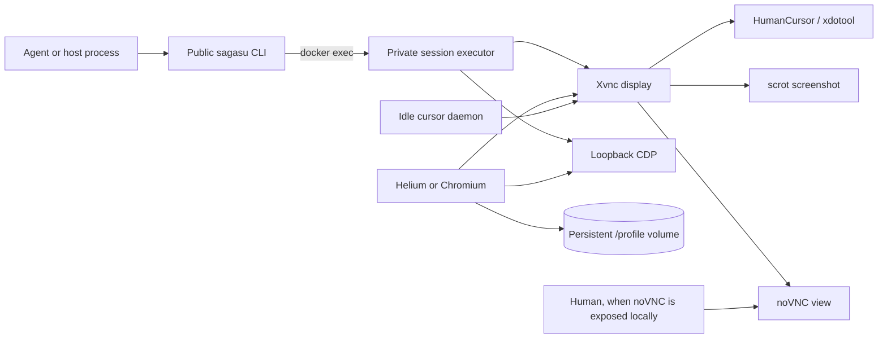

# Sagasu

**Vision-first browser control inside persistent Docker sessions.**

Sagasu runs a real, headful Chromium-family browser on a virtual X11 display.
An agent sees the full display, including browser chrome and overlays, and
drives its real X cursor through HumanCursor. CDP is a supplemental channel for
structured operations: capture the current DOM, map a visible CSS element into
screen coordinates, navigate directly to a URL, or insert Unicode text into an
already focused field.

The current repository provides the browser image, a persistent preview
session, the host-side session-control CLI, safe artifact handling, bounded
multi-action sequences, idle cursor motion, and a basic manual human-control
pause. It does **not** yet provide automated session creation, a handoff queue,
or the centralized human panel described in the longer-term design.

## Current status

| Implemented now | Planned, not implemented |
| --- | --- |
| Helium or Chromium in Xvnc/Openbox | `sagasu setup` and `sagasu config` |
| Persistent browser profile volume | `sagasu session start/stop` lifecycle |
| Full-display screenshots | Centralized intervention queue and panel |
| HumanCursor X-level mouse control | Public handoff request/status commands |
| `xdotool` cursor fallback | General X keyboard press/type commands |
| CDP DOM, locate, navigate, and focused text insertion | CDP lifecycle waits, uploads, cookies, and accessibility tools |
| Up to three queued mutations plus an automatic screenshot | MCP server or inline image responses |
| Continuous idle cursor animation | Shared-login, multi-window session mode |
| Private pause/resume for manual handoff | Automatic human-resume signaling |

The implemented public CLI commands are:

```text
sagasu session display
sagasu session screenshot
sagasu session dom
sagasu session locate
sagasu session navigate
sagasu session insert-text
sagasu session sequence
sagasu session cursor position|move|click|drag|scroll
```

## The problem

Browser agents need a controlled environment that does not take over the
operator's desktop, can keep authenticated state between tasks, and can be
handed to a person when a login or CAPTCHA appears. A browser container gives
each session its own screen, cursor, process tree, and profile. The same X11
display can be viewed through noVNC, so a person and an agent can work in the
same browser rather than moving cookies or recreating the challenge elsewhere.

Persistent profiles also reduce repeated login and challenge work. Cookies and
trusted-device state remain in the profile volume when the container stops or
is recreated. Profiles are sensitive account material and must be protected
accordingly.

Sagasu does not solve or bypass CAPTCHAs. The current handoff mechanism pauses
agent mutations and lets a human work in the existing browser. Fleet-wide
request tracking and automatic resume are roadmap work. Additional design and
implementation considerations live in [Problems.md](./Problems.md).

## Architecture



One container represents one browser session. Xvnc supplies both the X server
and VNC server, Openbox manages the browser window, websockify/noVNC provides a
human view, and a local `socat` relay exposes Chromium's loopback CDP socket to
the private executor. The idle daemon is noncritical; the browser, X server,
noVNC, and CDP relay are supervised as critical session components.

## Interaction model

Sagasu is deliberately asymmetric:

1. **See with the full X display.** Screenshots are the primary source of
   truth because they include browser chrome, popups, overlays, and challenge
   iframes that the top-level DOM may not reveal.
2. **Point through the real X cursor.** HumanCursor is the default backend for
   move, click, drag, and scroll. It moves the same cursor a human sees through
   noVNC.
3. **Use the DOM only when more detail is needed.** DOM extraction and CSS
   location supplement vision; they are not fetched automatically after every
   frame.
4. **Use CDP for inherently structured operations.** The built-in CDP verbs are
   direct navigation, DOM capture, CSS-element location, and Unicode insertion
   into the focused field.

The project does not currently expose general X keyboard typing. For text
entry, first establish focus with an X-level click and then call
`session insert-text`. This is especially important for CJK text, which is not
reliable through an X keyboard map.

## Quick start

Requirements:

- Docker with Compose support
- Python 3.10 or newer for the host CLI and tests

Build the default Helium image and start the persistent preview container:

```bash
docker build -t sagasu/session:dev .
docker compose up -d
```

To build the stock Chromium variant instead:

```bash
docker build -t sagasu/session:chromium --build-arg BROWSER=chromium .
```

Change the Compose image tag if you want the preview service to use that
variant.

Check that the preview session is running and healthy:

```bash
docker inspect --format '{{.State.Running}} {{.State.Health.Status}}' sagasu-preview
```

Until the package is installed on the host, run the CLI from the repository
root with `PYTHONPATH=src`:

```bash
PYTHONPATH=src python3 -m sagasu.cli.main \
  session screenshot --container sagasu-preview \
  --out /tmp/sagasu-preview.png --overwrite
```

Alternatively, install the host CLI in a virtual environment:

```bash
python3 -m venv .venv
. .venv/bin/activate
python -m pip install -e .
sagasu --help
```

The Compose service uses a named volume mounted at `/profile`. `docker compose
stop`, `docker start sagasu-preview`, and normal container recreation retain
that profile. Do not use `docker compose down -v` unless you intentionally want
to delete the stored browser profile.

## Addressing a session

Every public session command requires exactly one target:

- `SESSION`: a UUID4 resolved through the Docker label
  `computer.sagasu.session.id=<uuid>`; or
- `--container NAME`: an explicit container-name override for development.

The included Compose preview has no generated session UUID, so its normal
target is:

```text
--container sagasu-preview
```

The resolver verifies that the selected container is running and carries
Sagasu image/session labels. UUID resolution requires exactly one running
container with that label. Lifecycle automation is not implemented yet, so
additional labeled containers and their profile volumes must currently be
created outside the CLI.

## CLI reference

The examples below use `sagasu`; prepend
`PYTHONPATH=src python3 -m sagasu.cli.main` when running from source.

```text
sagasu session display TARGET
sagasu session screenshot TARGET --out PATH [--no-pointer] [--overwrite]
sagasu session dom TARGET --out PATH [--overwrite]
sagasu session locate TARGET CSS_SELECTOR
sagasu session navigate TARGET URL
sagasu session insert-text TARGET TEXT
sagasu session sequence TARGET --actions-json JSON --out PATH
                                [--settle-ms N] [--no-pointer] [--overwrite]
sagasu session cursor TARGET position
sagasu session cursor TARGET move X Y
                              [--duration-ms N] [--steady] [--backend BACKEND]
sagasu session cursor TARGET click X Y
                               [--button BUTTON] [--count N] [--hold-ms N]
                               [--backend BACKEND]
sagasu session cursor TARGET drag X1 Y1 X2 Y2
                              [--duration-ms N] [--steady] [--backend BACKEND]
sagasu session cursor TARGET scroll X Y --steps N [--backend BACKEND]
```

Replace `TARGET` with either a UUID session ID or `--container NAME`.
`click`, `drag`, and `scroll` also accept the debugging-only `--current` form,
but normal automation should use explicit coordinates so movement and input
remain one locked operation.

Non-streaming commands write one structured JSON result to stdout. Expected
failures are structured JSON on stderr with a nonzero exit status. Screenshot,
DOM, and sequence commands publish their artifact at `--out` and return its
path in the JSON response.

### Full-display observation

Query the display or capture its current pixels:

```bash
sagasu session display --container sagasu-preview
sagasu session cursor --container sagasu-preview position
sagasu session screenshot --container sagasu-preview \
  --out /tmp/sagasu.png --overwrite
```

Screenshots include the X cursor by default. `--no-pointer` excludes it. The
PNG is streamed to a temporary file, validated, and atomically published.
Without `--overwrite`, Sagasu never silently replaces an existing destination
and has a fallback for filesystems that do not support hard links.

### HumanCursor X control

```bash
sagasu session cursor --container sagasu-preview move 500 300
sagasu session cursor --container sagasu-preview click 500 300
sagasu session cursor --container sagasu-preview drag 500 300 700 300
sagasu session cursor --container sagasu-preview scroll 700 500 --steps -4
```

Coordinates are integer pixels in the full-display screenshot space. Invalid
coordinates fail instead of being clamped. Positive scroll steps move upward;
negative steps move downward.

HumanCursor is selected by default. Pass `--backend xdotool` to opt into the
low-level fallback. Sagasu never changes backends implicitly after a failure.
`--duration-ms` controls move/drag duration; `--steady` requests a straighter
HumanCursor trajectory.

### Supplemental CDP tools

Capture the active top-level document only when structured detail is useful:

```bash
sagasu session dom --container sagasu-preview \
  --out /tmp/sagasu-page.html --overwrite
```

The output is the live `DOM.getOuterHTML` serialization. Sagasu accepts HTML,
standalone SVG, and XML documents, validates UTF-8 and size, and publishes the
artifact atomically. Cross-origin iframe documents are not flattened into the
top-level output, and linked stylesheets remain links.

Map a visible top-level CSS element into full-display coordinates:

```bash
sagasu session locate --container sagasu-preview 'button[type=submit]'
```

The result contains `screen.x` and `screen.y`. Location uses current browser
window, viewport, zoom, browser-chrome, and X-display metrics; it does not use a
fixed toolbar offset. It clips the element to the visible viewport and fails
if the match is missing or has no visible area. `locate` neither scrolls nor
clicks. Compare its point with a fresh screenshot before using it.

Navigate the active page directly:

```bash
sagasu session navigate --container sagasu-preview 'https://example.com/'
```

Only absolute HTTP(S) URLs are accepted. Success means Chromium accepted
`Page.navigate`; it does not mean the destination has finished loading. Take a
fresh screenshot before the next decision.

Insert text into the page element that already has focus:

```bash
sagasu session insert-text --container sagasu-preview '中文 search text'
```

`Input.insertText` supports Unicode but does not find or focus a field. Click
the visible field through X first, insert the text, and verify the result with
a screenshot.

## Bounded action sequences

`session sequence` queues deterministic input actions when no intermediate
visual decision is required. The container defaults to at most three actions,
waits one second after the last action, and captures one final screenshot:

```bash
sagasu session sequence --container sagasu-preview \
  --actions-json '[
    {"operation":"cursor.click","x":650,"y":312},
    {"operation":"text.insert","text":"apples"},
    {"operation":"cursor.click","x":603,"y":386}
  ]' \
  --out /tmp/sagasu-after.png --overwrite
```

Open the returned `output` image instead of immediately taking a second
screenshot.

Queueable actions and fields:

| Operation | Required fields | Optional fields |
| --- | --- | --- |
| `cursor.move` | `x`, `y` | `duration_ms`, `steady`, `backend` |
| `cursor.click` | `x`, `y` | `button`, `count`, `hold_ms`, `backend` |
| `cursor.drag` | `x1`, `y1`, `x2`, `y2` | `duration_ms`, `steady`, `backend` |
| `cursor.scroll` | `x`, `y`, `steps` | `backend` |
| `text.insert` | `text` | none |
| `page.navigate` | absolute HTTP(S) `url` | none |

`page.navigate` may only be the final action. Screenshot, DOM, locate, display,
pointer observation, and human pause/resume are not queue entries. Unknown
fields and JSON `null` in optional fields are rejected.

The host validates and canonicalizes the JSON before resolving the container.
The private executor receives that document through bounded stdin—not one
large Docker argument—and validates it again. Cursor backends are prepared
before the display lock. All coordinates are checked before the first
mutation, then one exclusive lock and idle gate cover the actions, settle
delay, and screenshot.

For no-overwrite output, the destination is exclusively reserved before the
executor can mutate the browser. A concurrent destination therefore blocks
the sequence before any input occurs, and foreign replacements are not
clobbered.

Actions are not transactional. If one action fails, earlier actions remain
applied, later actions are skipped, and Sagasu still attempts to publish a
diagnostic screenshot. The raised error includes its `output`, zero-based
`failed_index`, and completed/action counts. If pointer observation fails after
an applied action, that action remains completed and receives structured
`pointer_observation` metadata. If the final screenshot or pointer query fails,
the error includes validated `sequence_state`; do not blindly retry the
mutations.

Use a shorter sequence whenever a click can open a menu, suggestions, an
overlay, login, CAPTCHA, or otherwise move the next target.

Sequence configuration:

```text
SAGASU_SEQUENCE_MAX_ACTIONS=3
SAGASU_SEQUENCE_SETTLE_MS=1000
```

The maximum can be configured from 1 to 100. `--settle-ms` overrides the
per-call delay and accepts 0–30000 ms. The container's action limit remains
authoritative.

## Idle cursor motion

The container starts a noncritical HumanCursor idle daemon by default. After
five seconds without a command, it records the stopped cursor as a fixed
anchor and continuously chooses random visible points within 300 pixels. Each
movement gets a random duration from 0.3 to 2 seconds.

```text
SAGASU_IDLE_ENABLED=1
SAGASU_IDLE_AFTER_SECONDS=5
SAGASU_IDLE_RADIUS_PX=300
SAGASU_IDLE_MIN_DURATION_SECONDS=0.3
SAGASU_IDLE_MAX_DURATION_SECONDS=2
```

Every executor command counts as activity. A command announces priority,
waits for any current idle trajectory to finish, and prevents another idle
movement from starting until the command completes. Human pause disables idle
motion, resume starts a new cooldown, and unexpected external pointer movement
also resets the idle state. Idle mode never clicks, scrolls, drags, or types,
but its real X movement can still trigger page hover effects. Set
`SAGASU_IDLE_ENABLED=0` when that is undesirable.

## Manual human intervention

The image contains noVNC and a private pause marker, but the public handoff
queue and panel are not implemented. The Compose file intentionally does not
publish noVNC. For local development only, uncomment this loopback mapping and
recreate the service:

```yaml
ports:
  - "127.0.0.1:9222:9222"
  - "127.0.0.1:6080:6080"
```

Then open `http://127.0.0.1:6080/`. The current noVNC endpoint has no session
password, so never bind it to `0.0.0.0` or a LAN/public address.

Pause agent mutations before handing control to a person:

```bash
docker exec --user sagasu sagasu-preview \
  sagasu-session-exec human pause
```

While paused, cursor actions, CDP mutations, and sequences fail with
`human_control`; idle motion is disabled. Observation commands remain
technically available, but an agent should stop interacting until the person
confirms completion. Resume with:

```bash
docker exec --user sagasu sagasu-preview \
  sagasu-session-exec human resume
```

Capture a fresh screenshot before continuing. These private commands are the
current bare handoff mechanism, not a stable public handoff API.

## Profiles and container lifecycle

The browser always uses `PROFILE_DIR` (`/profile` by default). The included
Compose service mounts a named volume there, so cookies, logins, local storage,
and trusted-device state survive container restarts and image updates.

On a graceful stop, the supervisor terminates the browser first and waits for
its profile databases to flush before stopping Xvnc and the support processes.
On the next start, the entrypoint removes stale Chromium `Singleton*` locks
left by an earlier forced termination.

The service uses `restart: "no"`. A critical session component exiting ends
the container instead of silently resurrecting a browser session. The idle
daemon is the exception: if it exits, browsing continues with idle motion
disabled.

Profiles contain authenticated session material. Keep profile volumes local,
restrict Docker access, and delete a volume only as an explicit account-state
operation.

## Container configuration

Important image environment variables:

| Variable | Default | Purpose |
| --- | --- | --- |
| `START_URL` | `about:blank` | Initial browser URL |
| `SCREEN_GEOMETRY` | `1366x768` | X display and browser-window size |
| `PROFILE_DIR` | `/profile` | Persistent browser profile path |
| `BROWSER_EXTRA_ARGS` | empty | Additional browser flags |
| `SAGASU_NO_SANDBOX` | empty | Dangerous debugging escape hatch |
| `SAGASU_IDLE_ENABLED` | `1` | Enable the idle cursor daemon |
| `SAGASU_IDLE_AFTER_SECONDS` | `5` | Idle delay before motion |
| `SAGASU_IDLE_RADIUS_PX` | `300` | Radius around the fixed idle anchor |
| `SAGASU_IDLE_MIN_DURATION_SECONDS` | `0.3` | Minimum idle movement duration |
| `SAGASU_IDLE_MAX_DURATION_SECONDS` | `2` | Maximum idle movement duration |
| `SAGASU_SEQUENCE_MAX_ACTIONS` | `3` | Container-authoritative queue limit |
| `SAGASU_SEQUENCE_SETTLE_MS` | `1000` | Default delay before final screenshot |

The default image uses Helium. Build with `--build-arg BROWSER=chromium` for
stock Chromium. HumanCursor, websocket-client, noVNC, and browser downloads are
pinned in the Dockerfile.

## Security model

- The browser runs as the unprivileged `sagasu` user.
- Chromium's sandbox remains enabled by default through the supplied seccomp
  policy; the container adds no capabilities and is not privileged.
- `SAGASU_NO_SANDBOX=1` is for debugging only. It allows a renderer compromise
  to read the entire authenticated profile.
- VNC listens only on container loopback and is never published.
- noVNC is reachable inside the Compose network but is unpublished by default.
- CDP is unauthenticated browser control and is published only on host
  `127.0.0.1:9222`. Never change that mapping to a non-loopback address.
- Output files use validation and atomic/no-clobber publication.
- A per-container lock allows compatible observations together but rejects
  conflicting input rather than interleaving two actors on one cursor.

## Concurrency and multiple sessions

One X display has one cursor and one keyboard focus. Sagasu serializes input
inside a container; it does not pretend that multiple agents can independently
drive one display.

Parallelism is container-level: each concurrent browser needs its own
container, profile volume, display, and optional host ports. The host CLI can
resolve manually created containers by UUID4 session labels, but the command
that creates and destroys those containers is not implemented yet. The
included Compose file is therefore a single-session preview, and its explicit
container-name override is the supported development path.

## Testing

Install the test dependency and run the suite:

```bash
python -m pip install -e '.[test]'
pytest -q
```

Live tests require a built, healthy container:

```bash
SAGASU_LIVE_CONTAINER=sagasu-preview pytest -m live tests/integration
```

Idle-specific live coverage also requires:

```bash
SAGASU_LIVE_CONTAINER=sagasu-preview \
SAGASU_LIVE_IDLE=1 \
pytest -m live tests/integration
```

The unit suite covers the CLI/protocol, Docker resolution and streaming,
artifact safety, CDP utilities, coordinate conversion, HumanCursor/xdotool
backends, idle arbitration, action sequences, and architecture boundaries.

## Repository layout

```text
sagasu/
├── pyproject.toml
├── src/sagasu/
│   ├── protocol.py       # shared JSON success/error protocol
│   ├── cli/              # public CLI, private executor, sequence, idle daemon
│   ├── sessions/         # Docker resolution, locks, activity, artifact flow
│   ├── artifacts/        # PNG/DOM validation and safe publication
│   ├── cdp/              # CDP transport, targets, DOM, locate, navigate, text
│   └── xcontrol/         # X display capture and cursor control
├── tests/                # unit and opt-in live-container coverage
├── Dockerfile            # Xvnc, browser, HumanCursor, noVNC, executor
├── docker-compose.yml    # persistent single-session preview
└── docker/               # entrypoint, supervisor, healthcheck, seccomp
```

Architecture tests enforce dependency direction: `xcontrol` cannot import
CDP, session, artifact, or CLI modules; the CLI is the composition layer that
joins those domains.

## Roadmap

The next major layers are intentionally not presented as current features:

- interactive setup/configuration;
- profile-aware session start/stop and port allocation;
- a public human-intervention API with request state and resume signaling;
- an authenticated panel embedding per-session noVNC views;
- general X keyboard operations;
- CDP lifecycle waits, file uploads, cookies, and accessibility data;
- optional MCP transport and inline screenshots; and
- an explicitly different shared-login multi-window mode.

Until those exist, Sagasu is best understood as a secure, persistent browser
container plus a tested X-first session-control CLI.

## Principles

- **X cursor first.** Use screenshots and the real cursor for ordinary visual
  interaction; use CDP only when the operation is naturally structured.
- **Vision before DOM.** Pixels are authoritative for overlays, browser chrome,
  and blockers; fetch structure only when it adds useful detail.
- **Handoff, not bypass.** Pause for login, 2FA, CAPTCHA, and other human-only
  steps instead of trying to circumvent them.
- **Profiles are secrets.** Persistent browser state is authenticated account
  material, not disposable cache.
- **No unsafe network defaults.** VNC stays private, noVNC stays unpublished,
  and CDP remains loopback-only.
